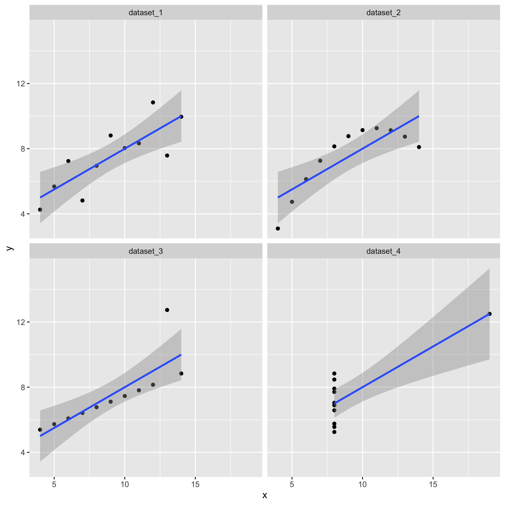

The following exercises are a test in disguise.

What do you think about the coding?

Can you think of any improvements to the following?

`library(tidyverse)`

# PROBLEM 1

> Visualizing your data is important! Summary statistics can be highly misleading, and simply plotting the data can reveal a lot more! Lets look at the Anscombe's Quartet data. There are four different data sets. Anscombe, F. J. (1973). "Graphs in Statistical Analysis". American Statistician. 27 (1): 17--21. <doi:10.1080/00031305.1973.10478966>\>. JSTOR 2682899.

**let's explore the dataset**

```         
anscombe_quartet = readRDS("data set/anscombe_quartet.rds") str(anscombe_quartet)
```

**What does the function str() do?** To display a short version of the structure of the dataset.

**let's check some summary statistics**

```         
tibble1 <- anscombe_quartet %>% 
  group_by(dataset) %>% 
  summarise(
    mean_x    = mean(x),
    mean_y    = mean(y),
    min_x     = min(x),
    min_y     = min(y),
    max_x     = max(x),
    max_y     = max(y),
    crrltn    = cor(x, y)
  )
tibble1
```

**What do the summary statistics tell us about the different datasets?** All datasets have the same mean_x, and approximately the same mean_y. data 1 to 3 have the same range on x axis, data 4 has a larger range on the x axis. All data sets have similar correlation values.

**let's plot the data with ggplot:**

```         
require(ggplot2)

ggplot(anscombe_quartet, aes(x=x,y=y)) +
  geom_point() + 
  geom_smooth(method = "lm",formula = "y ~ x") +
  facet_wrap(~dataset)

ggsave("figure/anscombe_quartet.png", width = 20, height = 20, units = "cm")
```



**What do the plots tell us about the different datasets?** Visulasing the relationship between x and y in the four datasets and how well do the data points fit in a linear model.

**Describe the relationship between x and y in the different datasets.** The data points form a linear relationship in dataset1 without ourlier. the datapoints in dataset2 better fit a quadratic relationship rather than linear. Most data in dataset3 fit well with the linear model but with one outlier. In dataset4, although there is a regression line, most changes along the y axis are not dependent on changes along the x axis.

**would linear regression be an appropriate statistical model to analyse the x-y relationship in each dataset?** It would be approproate for dataset1 and 3, but not for 2 and 4

**what conclusions can you draw for the plots and summary statistics?**The date in data set 1 and 3 follow a linear regression model, y changes porportionally according to the changes in x. Data in dataset2 does not follow the linear model and a quadratic model may be needed to explore the relationship. Much more observations are needed for dataset4 to confirm the regression model. Visually different graph can have simialr correlation values.

## PROBLEM 2

**load in the datasaurus dataset**

```         
library(tidyverse)
datasaurus_dozen = readRDS("data set/datasaurus_dozen.rds")
```

**explore the dataset**

```         
str(datasaurus_dozen) 
```

**how many rows and columns does the datasaurus_dozen file have?** #1846 rows and 3 columns

**plot the dataset**

```         
require(ggplot2) 

plot_1 <- ggplot(datasaurus_dozen, aes(x=x,y=y)) +
  geom_point() + 
  geom_smooth(method = "lm",formula = "y ~ x")
plot_1

ggsave("figure/plot1.png", width = 20, height = 20, units = "cm")
```


**calculate the correlations and summary statistics for x and y in all datasets**

```         
tibble2 <- datasaurus_dozen %>% 
  group_by(dataset) %>% 
  summarise(
    mean_x    = mean(x),
    mean_y    = mean(y),
    min_x     = min(x),
    min_y     = min(y),
    max_x     = max(x),
    max_y     = max(y),
    crrltn    = cor(x, y)
  )
tibble2
```

**Plot the relationships between x and y in each dataset including the line of best fit.**

```         
plot_2 <- ggplot(datasaurus_dozen, aes(x=x,y=y)) +
  geom_point() + 
  geom_smooth(method = "lm",formula = "y ~ x") +
  facet_wrap(~dataset)
plot_2

ggsave("figure/saurus_dozen.png", width = 20, height = 20, units = "cm")
```


**what conclusions can you draw for the plots and summary statistics?** Data sets that have similar correlation values could have very different distribution of data points.
